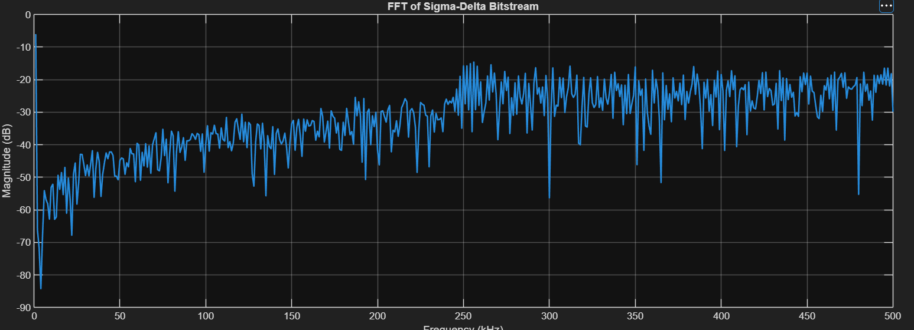
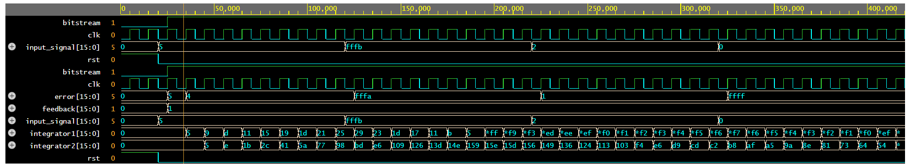
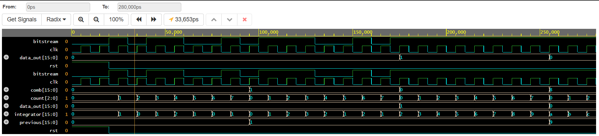
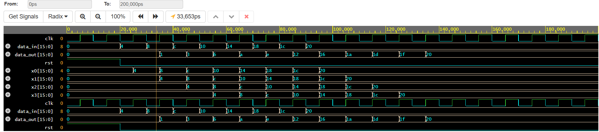
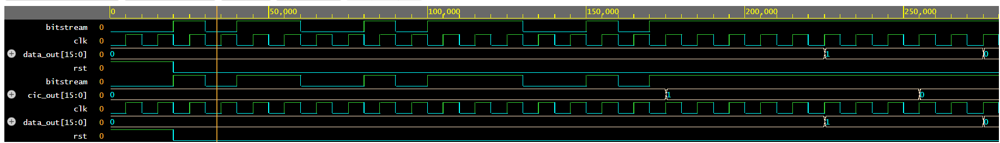

# Sigma-Delta ADC Modeling and RTL Implementation

A complete behavioral implementation of a Sigma-Delta Analog-to-Digital Converter (ADC) covering MATLAB modeling, digital signal processing, and Verilog RTL design.

---

# Features

- MATLAB behavioral modeling
- First-order Sigma-Delta Modulator
- Second-order Sigma-Delta Modulator
- FFT Spectrum Analysis
- Signal-to-Noise Ratio (SNR) Estimation
- Effective Number of Bits (ENOB) Calculation
- DC Linearity Testing
- CIC Decimation Filter
- FIR Low-Pass Filter
- Complete Digital Decimation Chain
- Behavioral Verilog RTL Implementation
- RTL Testbench Verification

---

# Project Overview

Sigma-Delta ADCs achieve high-resolution analog-to-digital conversion using oversampling, noise shaping, and digital filtering.

This project demonstrates the complete Sigma-Delta ADC design flow:

- Behavioral modeling in MATLAB
- Performance analysis using FFT, SNR, and ENOB
- Digital filtering using CIC and FIR filters
- Behavioral RTL implementation in Verilog
- Functional verification using simulation waveforms

---

# Project Architecture

```text
                 Analog Input
                      │
                      ▼
        Sigma-Delta Modulator
                      │
                1-bit Bitstream
                      │
                      ▼
              CIC Decimation Filter
                      │
                      ▼
             FIR Low-Pass Filter
                      │
                      ▼
          Decimated Digital Output
```

---

# MATLAB Implementation

The MATLAB portion of the project includes behavioral modeling and performance evaluation of Sigma-Delta ADCs.

---

## First-Order Sigma-Delta Modulator

Implemented:

- Difference amplifier
- Integrator
- 1-bit Quantizer
- DAC feedback
- Time-domain analysis

### Full Behavioral Simulation


The simulation illustrates:

- Analog input waveform
- Difference amplifier output
- Integrator response
- 1-bit Sigma-Delta bitstream

### Zoomed View


The zoomed waveform clearly shows the pulse-density modulation process, where the density of 1s and 0s tracks the instantaneous analog input.

---

## Second-Order Sigma-Delta Modulator

Implemented:

- Cascaded integrator architecture
- Improved noise shaping
- 1-bit quantizer
- DAC feedback
- Time-domain analysis

### Full Behavioral Simulation


The second-order architecture demonstrates enhanced noise shaping through the use of two cascaded integrators.

### Zoomed View


The zoomed waveform highlights the operation of both integrators and the corresponding Sigma-Delta bitstream.

---

## FFT Spectrum Analysis

FFT analysis was performed on the generated Sigma-Delta bitstream to observe spectral characteristics and quantization noise distribution.



The FFT demonstrates:

- Signal frequency component
- Quantization noise distribution
- Noise shaping behavior of the Sigma-Delta modulator

---

## Performance Evaluation

### Signal-to-Noise Ratio (SNR)

Computed using FFT-based signal and noise power estimation.

### Effective Number of Bits (ENOB)

Calculated using

```
ENOB = (SNR - 1.76) / 6.02
```

---

## DC Linearity Test

The ADC was verified using constant DC input levels to evaluate average bitstream output and linearity.

---

## Digital Filters

### CIC Filter

Implemented:

- Integrator stage
- Decimator
- Comb stage

### FIR Filter

Implemented:

- Moving-average FIR filter
- Low-pass smoothing
- Output reconstruction

### Complete Decimation Chain

The digital processing chain combines

```
Bitstream
    │
    ▼
CIC Filter
    │
    ▼
FIR Filter
    │
    ▼
Final Digital Output
```

---

# Verilog RTL Implementation

Behavioral RTL was developed for the complete digital processing chain.

---

## First-Order Sigma-Delta RTL

Implemented:

- First-order Sigma-Delta modulator
- Behavioral testbench
- Functional verification


---

## Second-Order Sigma-Delta RTL

Implemented:

- Second-order Sigma-Delta modulator
- Behavioral testbench
- Functional verification



---

## CIC Filter RTL

Behavioral RTL implementation of the Cascaded Integrator-Comb (CIC) filter.



---

## FIR Filter RTL

Behavioral RTL implementation of a moving-average FIR low-pass filter.



---

## Complete Decimation Chain RTL

Integration of the CIC and FIR filters to produce the final decimated digital output.



---

# Repository Structure

```text
sigma-delta-adc/

├── matlab/
│   ├── first_order/
│   ├── second_order/
│   └── filters/
│
├── verilog/
│   ├── first_order/
│   ├── second_order/
│   └── filters/
│
├── images/
│
└── README.md
```

---

# Results Summary

| Module | Status |
|---------|--------|
| MATLAB First-Order Sigma-Delta Modulator | ✅ Verified |
| MATLAB Second-Order Sigma-Delta Modulator | ✅ Verified |
| FFT Analysis | ✅ Completed |
| SNR Estimation | ✅ Completed |
| ENOB Calculation | ✅ Completed |
| DC Linearity Test | ✅ Completed |
| CIC Filter | ✅ Verified |
| FIR Filter | ✅ Verified |
| Complete Decimation Chain | ✅ Verified |
| Verilog RTL Implementation | ✅ Verified |
| RTL Testbenches | ✅ Completed |

---

# Tools Used

- MATLAB Online
- Verilog HDL
- EDA Playground
- GitHub

---

# Concepts Covered

- Oversampling
- Noise Shaping
- Quantization
- FFT
- Signal-to-Noise Ratio (SNR)
- Effective Number of Bits (ENOB)
- CIC Filtering
- FIR Filtering
- Decimation
- Digital Signal Processing
- Verilog RTL Design
- Hardware Verification

---

# Future Improvements

Possible extensions include:

- Higher-order Sigma-Delta modulators
- Fixed-point arithmetic optimization
- Parameterizable digital filter architectures
- FPGA implementation
- Hardware validation
- Power and area optimization

---

# Author

**Aryan Lohiya**

B.Tech – Integrated Circuit Design and Technology (ICDT)

Indian Institute of Technology Gandhinagar

---

# License

This project is intended for educational and learning purposes.
