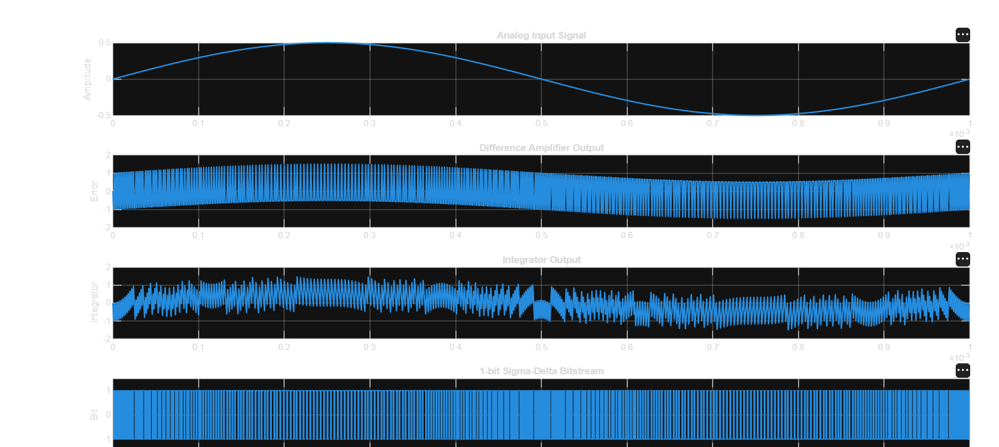
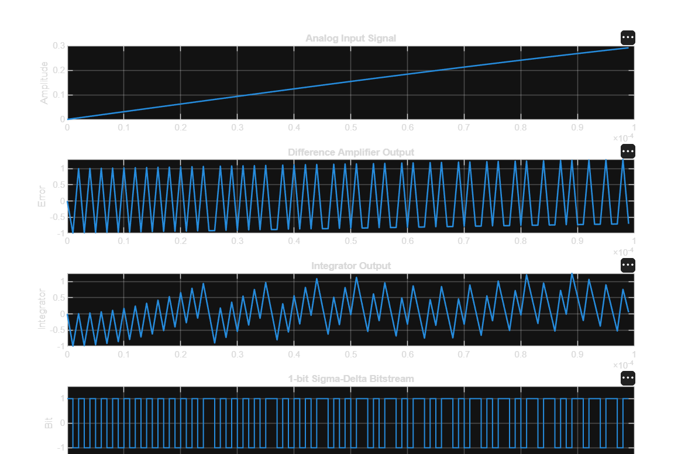
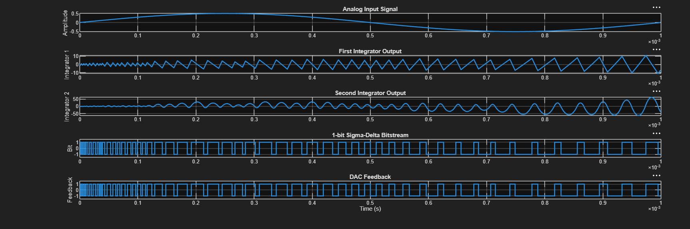
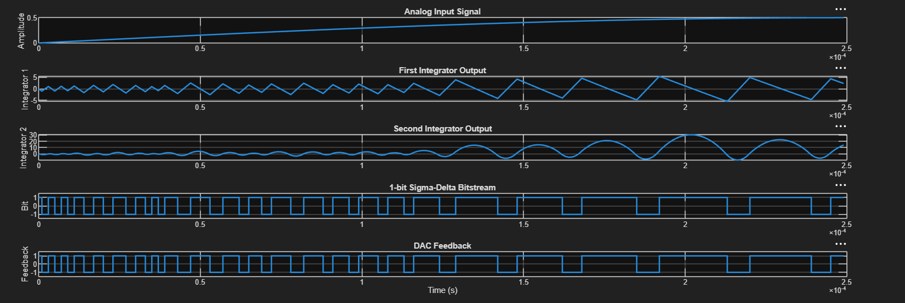

# Sigma-Delta ADC Modeling and RTL Implementation

Behavioral MATLAB modeling and Verilog RTL implementation of a Sigma-Delta Analog-to-Digital Converter (ADC), including first-order and second-order Sigma-Delta modulators, digital decimation filters, FFT analysis, and performance evaluation.

---

# Features

- MATLAB behavioral modeling
- First-order Sigma-Delta Modulator
- Second-order Sigma-Delta Modulator
- FFT Spectrum Analysis
- Signal-to-Noise Ratio (SNR) Estimation
- Effective Number of Bits (ENOB) Calculation
- DC Linearity Testing
- CIC Decimation Filter
- FIR Low-Pass Filter
- Complete Digital Decimation Chain
- Behavioral Verilog RTL Implementation
- RTL Testbench Verification
- Waveform Simulation using EDA Playground

---

# Project Overview

Sigma-Delta ADCs achieve high-resolution analog-to-digital conversion using oversampling, noise shaping, and digital filtering.

This project demonstrates the complete Sigma-Delta ADC design flow:

- Behavioral modeling in MATLAB
- Performance analysis using FFT, SNR, and ENOB
- Digital filtering using CIC and FIR filters
- Behavioral RTL implementation in Verilog
- Functional verification using simulation waveforms

---

# Project Architecture

```text
                 Analog Input
                      │
                      ▼
        Sigma-Delta Modulator
                      │
                1-bit Bitstream
                      │
                      ▼
              CIC Decimation Filter
                      │
                      ▼
             FIR Low-Pass Filter
                      │
                      ▼
          Decimated Digital Output
```

---

# MATLAB Behavioral Modeling

The MATLAB implementation consists of:

## First-Order Sigma-Delta Modulator

- Behavioral implementation
- Difference amplifier
- Integrator
- 1-bit Quantizer
- DAC feedback
- Time-domain visualization

---

## Second-Order Sigma-Delta Modulator

- Two-stage integrator architecture
- Improved noise shaping
- Enhanced quantization noise suppression
- Time-domain analysis

---

## FFT Analysis

Implemented to evaluate frequency-domain performance.

Features include:

- Signal spectrum
- Noise floor visualization
- Signal-to-noise ratio estimation

---

## Performance Evaluation

### Signal-to-Noise Ratio (SNR)

Computed using FFT-based signal and noise power estimation.

### Effective Number of Bits (ENOB)

Calculated using

```text
ENOB = (SNR - 1.76) / 6.02
```

---

## DC Linearity Test

Implemented using a DC input sweep to verify average output linearity.

---

## Digital Filters

### CIC Filter

Implemented stages:

- Integrator
- Decimation
- Comb Filter

---

### FIR Low-Pass Filter

Implemented features:

- 4-tap Moving Average Filter
- Low-pass smoothing
- Output reconstruction

---

### Complete Decimation Chain

```text
Bitstream
    │
    ▼
CIC Filter
    │
    ▼
FIR Filter
    │
    ▼
Final Digital Output
```

---

# Verilog RTL Implementation

Behavioral RTL models were developed for all major digital blocks.

## First-Order Sigma-Delta Modulator

- RTL implementation
- Testbench
- Waveform verification

---

## Second-Order Sigma-Delta Modulator

- RTL implementation
- Testbench
- Waveform verification

---

## CIC Filter

- Integrator stage
- Comb stage
- Decimation
- Testbench

---

## FIR Filter

- 4-tap Moving Average FIR Filter
- Testbench

---

## Top-Level Decimation Chain

- CIC Filter instantiation
- FIR Filter instantiation
- Complete digital signal flow verification

---

# Simulation Results

## First-Order Sigma-Delta Modulator

### Full Behavioral Simulation



The simulation illustrates:

- Analog input waveform
- Difference amplifier output
- Integrator response
- 1-bit Sigma-Delta bitstream


---

### Zoomed View



The zoomed waveform demonstrates how the density of the output bitstream follows the input amplitude.

---

## Second-Order Sigma-Delta Modulator


### Full Behavioral Simulation



The full waveform illustrates the operation of the second-order Sigma-Delta modulator over one complete input cycle. The additional integrator stage provides improved noise shaping compared to the first-order architecture.

### Zoomed View



The zoomed waveform highlights the internal operation of the second-order modulator, including:

- Analog input signal
- First integrator output
- Second integrator output
- 1-bit Sigma-Delta bitstream
- DAC feedback signal

The increased bitstream density follows the input amplitude, while the cascaded integrators provide stronger quantization noise shaping.

## FFT Spectrum

*(Add FFT spectrum screenshot here.)*

---

## RTL Simulation Results

### First-Order Modulator

*(Add EPWave screenshot)*

---

### Second-Order Modulator

*(Add EPWave screenshot)*

---

### CIC Filter

*(Add EPWave screenshot)*

---

### FIR Filter

*(Add EPWave screenshot)*

---

### Complete Decimation Chain

*(Add EPWave screenshot)*

---

# Repository Structure

```text
sigma-delta-adc/

├── matlab/
│
│   ├── first_order/
│   ├── second_order/
│   └── filters/
│
├── verilog/
│
│   ├── first_order/
│   ├── second_order/
│   └── filters/
│
├── images/
│
└── README.md
```

---

# Tools Used

- MATLAB Online
- Verilog HDL
- EDA Playground
- GitHub

---

# Concepts Covered

- Sigma-Delta Modulation
- Oversampling
- Noise Shaping
- Quantization
- FFT Analysis
- Signal-to-Noise Ratio (SNR)
- Effective Number of Bits (ENOB)
- CIC Filtering
- FIR Filtering
- Decimation
- Digital Signal Processing
- Verilog RTL Design
- Digital System Verification

---

# Future Improvements

Possible future extensions include:

- Fixed-point arithmetic optimization
- Higher-order Sigma-Delta modulators
- Parameterizable Oversampling Ratio (OSR)
- Parameterizable digital filter architecture
- FPGA synthesis and hardware validation
- Power and area optimization

---

# Author

**Aryan Lohiya**

B.Tech – Integrated Circuit Design and Technology (ICDT)

Indian Institute of Technology Gandhinagar

---

# License

This project is intended for educational and learning purposes.
This project is intended for educational and learning purposes.
